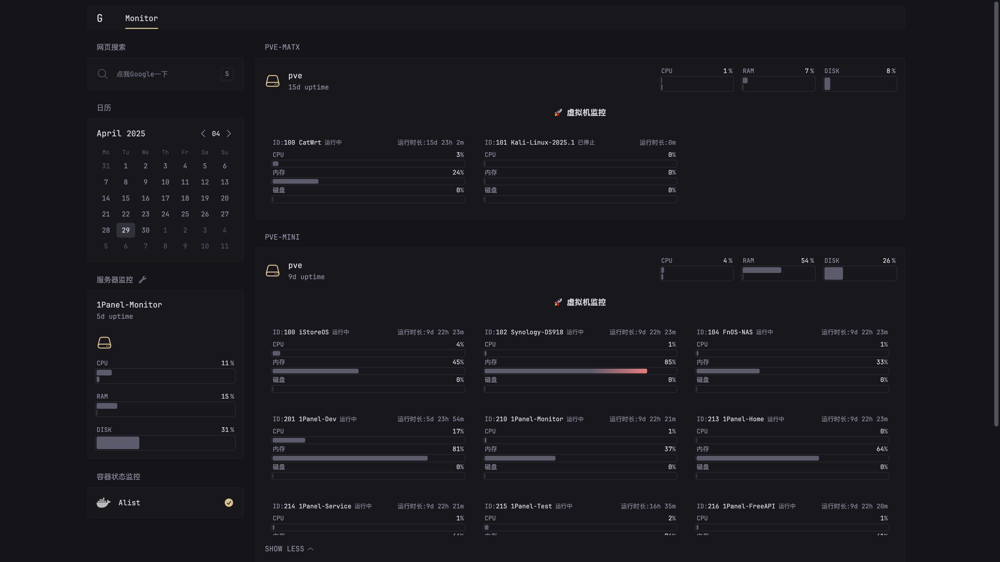

<em>简单配置即可获得优美的系统监控面板.</em>

<h1 align="center">Glance-Monitor</h1>

### 前言介绍
本项目是基于[https://github.com/glanceapp/glance](https://github.com/glanceapp/glance)  进行的二开版本，主要是添加PVE主机的监控信息、对面板进行部分汉化。

> 项目主要满足自己的监控需求，代码用AI生成，未做过多校验和优化，就不提交PR给源项目了

### 项目说明

- 添加Proxmox VE主机的信息状态监控，包括CPU、内存和硬盘使用率；
- 通过PVE的API接口，读取并展示虚拟机的ID、名称、运行状态、运行时长和资源消耗等；
- 支持在glance.yml中配置是否隐藏已停止虚拟机的卡片；
- 多虚拟机情况下，默认展示按照ID排序前4个虚拟机卡片，可通过`SHOW MORE`按钮展示全部卡片；
- 资源监控适配变色告警，超出阈值后，状态条颜色加深；
- 监控页面适配不同分辨率下展示效果，支持手机访问自适应

### 后续计划

原项目已支持本机服务器和容器监控，但远程监控尚未完善，取决于原作者对这块的支持，考虑是否自行增加远程服务器监控。

### Glance特点

#### 多种小部件
* RSS 馈送
* 多个 Reddit帖子
* Hacker News 帖子
* 天气预报
* YouTube 频道上传
* Twitch 频道
* 市场价格
* Docker 容器状态
* 服务器统计
* 自定义小部件
* [和更多...](docs/configuration.md)

#### 快速轻量
* 低内存使用
* 少量依赖性
* 极简 vanilla JS
* 多个操作系统和架构的<20MB二进制文件和同样小的 Docker 容器
* 无缓存页面通常在~1s内加载(取决于网速和小部件的数量)

#### 大量可定制性
* 不同布局
* 根据需要创建许多页面/标签
* 为每个小部件配置许多选项
* 为某些小部件选择不同的样式
* 自定义 CSS

#### 优化移动设备

#### 可以更改主题
通过修改数字很容易创建属于自己的主题，或从现成主题中选择：[已有的主题](docs/themes.md)。

